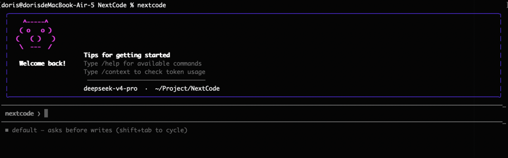
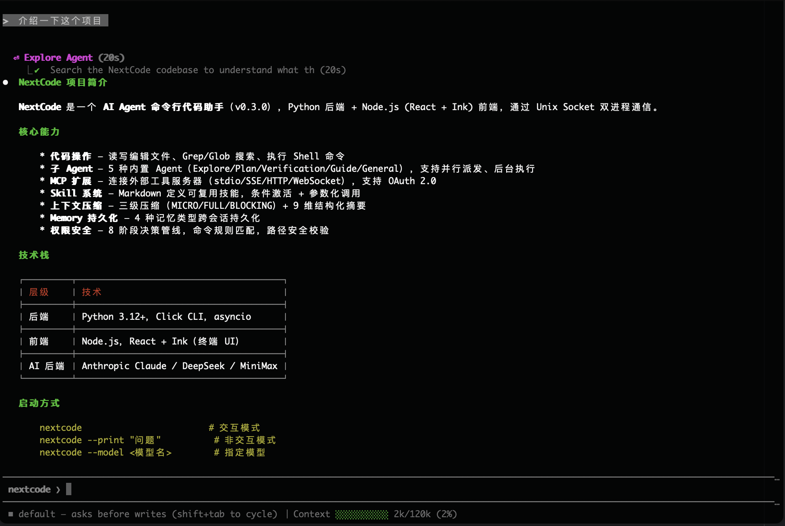
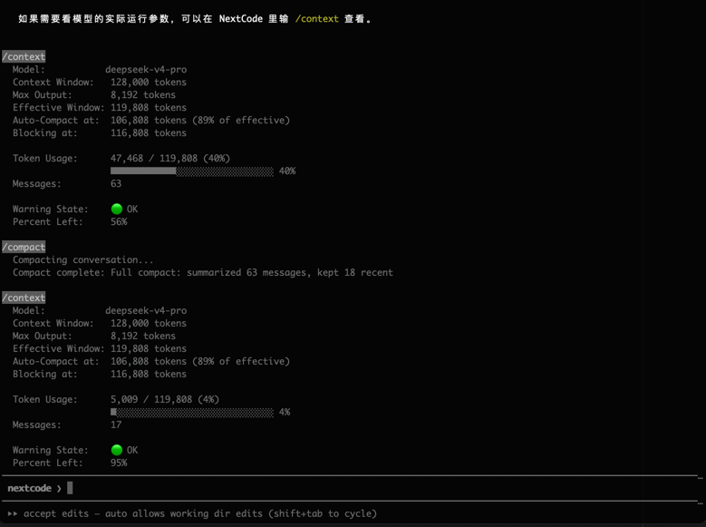

# NextCode

AI Agent代码助手，保留Agent核心架构设计机制。支持读取、编辑、创建文件，搜索代码库，运行 Shell 命令，修 Bug、加功能、做代码审查；支持并行派发多个子 Agent 处理独立任务，后台执行长时间构建/测试并自动汇总结果；内置上下文压缩（MICRO/FULL/BLOCKING 三级压缩 + 9 维摘要）和持久化记忆管理（4 种 Memory 类型 + Dream 自动整合），5 种 Agent（Explore/Plan/Verification/Guide/General）覆盖代码探索、架构规划、对抗审查、功能导航和通用任务；通过 MCP 扩展连接外部工具服务器，8 阶段权限管线保障执行安全。


[](https://www.python.org/)
[](LICENSE)
[](https://github.com/psf/black)

运行示例：





上下文压缩：



## 特性

- **Ink 终端 UI** — React + Ink 前端，双进程 IPC 架构，Python 后端 + Node.js 前端，Unix Domain Socket 双向 JSON-Line 通信
- **多模型支持** — DeepSeek / Claude / MiniMax，自动选择 API 后端
- **Agent 系统** — 5 种内置 Agent（Explore/Plan/Verification/Guide/General），后台执行 + 语义去重 + 批量汇总，支持自定义 Agent，3 层工具过滤、上下文隔离、6 阶段生命周期
- **MCP 扩展** — 5 种传输类型（stdio/SSE/HTTP/WebSocket/SDK），OAuth 2.0 + PKCE 认证，headersHelper 动态鉴权，自动重连（指数退避），企业策略管控，并发连接调度
- **Skill 系统** — Markdown → PromptCommand 转换，条件激活（路径匹配），懒惰加载，目录发现
- **核心工具集** — Bash、Read、Edit、Write、Glob、Grep、Agent、TaskStop、TaskOutput，MCP 工具自动代理注册
- **流式工具执行** — 并发分区执行 + 流式输出，contextvars 安全注入
- **上下文压缩** — 三级压缩（MICRO / FULL / BLOCKING）+ 断路器保护 + 9 维结构化摘要 + 文件状态重注入
- **Memory 系统** — 4 种类型（user/feedback/project/reference），相关性打分，老化淘汰，Dream 自动整合，Agent Memory 3 范围（user/project/local）
- **任务系统** — 后台 Bash/Agent 任务，磁盘输出（5GB 上限），看门狗交互检测，60s 自动驱逐，僵尸进程防护
- **命令系统** — `/help`、`/clear`、`/compact`、`/context`、`/thinking`、`/model`、`/log`、`/memory`、`/summary`、`/dangerous-bg-no-ask`、`/exit`，支持 Tab 补全和相似命令提示
- **权限系统** — 8 阶段决策管线，5 种模式循环，Shell 规则匹配（精确/前缀/通配符），路径安全校验，断路器防护
- **Prompt Cache** — 静态/动态 System Prompt 分割 + 工具 Schema 字节一致性缓存，最大化 Anthropic KV Cache 命中
- **API 韧性** — 指数退避重试 + 错误恢复策略（MaxOutputTokens 自动降级）+ 超时保护
- **分层配置** — 4 级优先级（默认 → 全局 → 项目 → 环境变量），Settings ↔ Store 双向同步

## 快速开始

### 安装

```bash
cd nextcode
pip install -e .
```

Ink 前端（可选）：

```bash
cd nextcode/frontend
npm install
npm run build
```

### 配置 API Key

```bash
# DeepSeek 模型
export NEXTCODE_API_KEY=your-deepseek-api-key

# Claude 模型
export ANTHROPIC_API_KEY=your-anthropic-api-key

# 或交互式配置
nextcode auth
```

### 使用

```bash
# 交互模式
nextcode

# 非交互模式
echo "解释什么是 Python 装饰器" | nextcode --print

# 指定模型
nextcode --model deepseek-reasoner
nextcode --model claude-sonnet-4-20250514

# 指定工作目录
nextcode --cwd /path/to/project

# 查看配置
nextcode config
```

## 内置命令

| 命令 | 说明 |
|------|------|
| `/help` | 显示帮助信息和可用命令列表 |
| `/clear` | 清空对话历史和任务状态 |
| `/compact` | 压缩对话历史（9 维结构化摘要 + 保留近期消息） |
| `/context` | 显示上下文窗口使用情况 |
| `/thinking` | 切换 Thinking 内容显示 |
| `/model` | 显示当前使用的模型 |
| `/log` | 显示对话循环状态日志 |
| `/memory` | 查看/列出/查询 Agent Memory |
| `/summary` | 显示会话摘要 |
| `/exit` `/quit` | 退出 REPL |

> 输入 `/` 后按 Tab 键可补全命令。输入错误命令时会提示相似命令。

## 可用工具

| 工具 | 说明 | 默认权限 |
|------|------|----------|
| `Read` | 读取文件内容 | 允许 |
| `Glob` | 按模式查找文件 | 允许 |
| `Grep` | 搜索文件内容 | 允许 |
| `Bash` | 执行 shell 命令 | 需确认 |
| `Edit` | 编辑文件（字符串替换） | 需确认 |
| `Write` | 写入文件 | 需确认 |
| `Agent` | 调用子 Agent 执行复杂任务 | 需确认 |
| `TaskStop` | 停止后台任务 | 允许 |
| `TaskOutput` | 获取后台任务输出 | 允许 |
| `Skill` | 调用 Skill 命令 | 允许 |
| `mcp__*` | MCP 工具（自动代理注册） | 需确认 |

## Agent 系统

### 内置 Agent

| Agent | 说明 | 禁用工具 |
|-------|------|----------|
| `Explore` | 快速代码库搜索专家，按模式查找文件、搜索关键词 | Edit, Write, Agent |
| `Plan` | 软件架构规划专家，4 步结构化规划，考虑替代方案 | Edit, Write |
| `Verification` | 对抗性代码审查，PASS/FAIL/PARTIAL 结果 | Edit, Write |
| `Guide` | NextCode 功能导航，动态注入 skills & MCP 信息 | Edit, Write, Bash, Agent |
| `General` | 通用型 Agent，完整工具访问，可派生子 Agent | 无 |

### Agent 调度机制

- **语义去重**：`intent + target` 防止重复派发同一任务
- **并发控制**：最多 5 个后台 Agent 同时运行
- **嵌套限制**：最大 2 层 Agent 嵌套
- **后台执行**：Agent 后台运行不阻塞主流程，批量完成后自动汇总
- **生命周期**：6 阶段（初始化 → 权限 → MCP → 上下文隔离 → 对话循环 → 清理）
- **僵尸防护**：Agent 退出时自动终止其创建的后台任务

### 自定义 Agent

在 `.nextcode/agents/` 目录创建 Markdown 文件：

```markdown
---
agent_type: my-agent
name: My Agent
description: 当需要执行特定任务时使用此 Agent
tools: ["Read", "Glob", "Grep"]
omit_claude_md: true
---
```

### Agent 调用

在对话中可以直接调用 Agent：

```
帮我探索这个代码库的结构
```

Agent 会自动被选择并执行，结果会流式返回给父 Agent。

## Skill 系统

### 创建 Skill

在 `.nextcode/skills/<name>/SKILL.md` 或 `.nextcode/skills/<name>.md` 创建 Skill 文件：

```markdown
---
description: 重写代码以提高性能
allowed_tools: ["Read", "Edit", "Glob", "Grep"]
model: deepseek-reasoner
context: inline
agent: Plan
when_to_use: 当代码存在性能问题需要优化时
argument_hint: <需要优化的代码片段或文件路径>
user_invocable: true
paths: ["src/**/*.py"]
---

你是性能优化专家。分析用户提供的代码，识别性能瓶颈，并提供优化建议。
```

### Skill 字段说明

| 字段 | 说明 |
|------|------|
| `description` | Skill 描述（显示给用户） |
| `allowed_tools` | 允许使用的工具列表 |
| `model` | 使用的模型（可选） |
| `context` | 上下文模式：`inline`（继承对话）或 `fork`（独立分支） |
| `agent` | 使用的 Agent 类型 |
| `when_to_use` | 何时使用此 Skill 的提示 |
| `argument_hint` | 参数提示 |
| `user_invocable` | 是否允许用户直接调用 |
| `paths` | 前置条件路径模式（非空时为条件激活） |
| `hooks` | 钩子配置 |

### 条件激活

带有 `paths` 的 Skill 会保持待激活状态，直到用户操作匹配的文件：

```markdown
---
name: frontend
paths: ["frontend/**/*", "src/**/*.tsx", "src/**/*.jsx"]
---
```

当用户读取或编辑 `frontend/` 目录下的文件时，该 Skill 会被激活。

### Skill 目录发现

支持渐进式 Skill 目录发现，从文件路径向上查找 `.nextcode/skills/`，适用于 monorepo 结构。

## MCP 扩展

NextCode 支持 [Model Context Protocol](https://modelcontextprotocol.io/)，可连接外部工具和数据服务器扩展能力。

### 快速添加

在项目根目录创建 `.mcp.json`，重启 NextCode 即可生效：

```json
{
  "mcpServers": {
    "playwright": {
      "command": "npx",
      "args": ["@playwright/mcp@latest"]
    }
  }
}
```

工具以 `mcp__<server>__<tool>` 命名注册（如 `mcp__playwright__browser_navigate`），需用户确认后执行。

### 传输类型

| 类型 | 说明 | 适用场景 |
|------|------|---------|
| `stdio`（默认） | 本地子进程通信 | 本地工具服务器（如 filesystem、git） |
| `http` | Streamable HTTP | 远程 HTTP 服务器（推荐） |
| `sse` | Server-Sent Events | 远程 HTTP 服务器（旧版） |
| `ws` | WebSocket | 双向实时通信 |
| `sdk` | 进程内 SDK | 内嵌式集成 |

### 配置示例

**本地工具（stdio）**：

```json
{
  "mcpServers": {
    "filesystem": {
      "command": "npx",
      "args": ["-y", "@modelcontextprotocol/server-filesystem", "/home/user/projects"]
    }
  }
}
```

**远程服务（HTTP）**：

```json
{
  "mcpServers": {
    "remote-api": {
      "type": "http",
      "url": "https://api.example.com/mcp",
      "headers": { "Authorization": "Bearer token" }
    }
  }
}
```

**带 OAuth 认证**：

```json
{
  "mcpServers": {
    "oauth-service": {
      "type": "http",
      "url": "https://api.example.com/mcp",
      "oauth": {
        "resource_url_url": "https://api.example.com/.well-known/oauth-protected-resource"
      }
    }
  }
}
```

**动态鉴权（headersHelper）**：

```json
{
  "mcpServers": {
    "cloud-api": {
      "type": "http",
      "url": "https://api.example.com/mcp",
      "headersHelper": "./scripts/get-auth-headers.sh"
    }
  }
}
```

### 配置来源与优先级

| 来源 | 配置文件 | 优先级 |
|------|---------|--------|
| 项目级 | `.mcp.json` | 低 |
| 用户级 | `~/.nextcode/.settings.json` | 中 |
| 本地 | `.nextcode/.settings.local.json` | 中高 |
| 动态 | `--mcp-config` CLI 参数 | 高 |
| 企业 | `managed-mcp.json`（独占模式） | 最高 |

### 常见 MCP 服务器

| 服务器 | 安装命令 | 用途 |
|--------|---------|------|
| Playwright | `npx @playwright/mcp@latest` | 浏览器自动化 |
| Filesystem | `npx @modelcontextprotocol/server-filesystem` | 文件系统访问 |
| GitHub | `npx @modelcontextprotocol/server-github` | GitHub API |
| PostgreSQL | `npx @modelcontextprotocol/server-postgres` | 数据库查询 |

### 连接与重连

- 启动时自动连接，日志输出状态：`MCP: <name> — connected/failed/needs-auth`
- 断开时自动重连，指数退避：1s → 2s → 4s → 8s → 16s（最大 30s），最多 5 次
- 会话过期（404 + -32001）立即重连，不计入退避计数
- OAuth Token 自动刷新，安全存储在 `~/.nextcode/mcp-tokens/`

### 企业策略

支持 `allowedMcpServers` / `deniedMcpServers` 策略管控：
- 按名称精确匹配、按命令匹配（stdio）、按 URL 通配符匹配
- 拒绝列表优先级高于允许列表
- 企业独占模式下仅加载企业配置，忽略所有其他来源

## 配置

### 配置优先级

设置按以下顺序加载（后者覆盖前者）：
1. 默认值
2. 全局配置 `~/.nextcode/.settings.json`
3. 项目配置 `.nextcode/.settings.json`
4. 环境变量

### 完整配置示例

```json
{
  "api_key": "sk-your-api-key",
  "model": "deepseek-reasoner",
  "context": {
    "max_tokens": 65536,
    "compact_threshold": 0.8,
    "auto_compact_buffer": 13000,
    "blocking_buffer": 3000,
    "circuit_breaker_max_failures": 3,
    "microcompact_keep_recent": 3
  },
  "permissions": {
    "allow": ["Read:*", "Glob:*", "Grep:*"],
    "deny": [],
    "ask": ["Bash:*", "Edit:*", "Write:*", "Agent:*"]
  }
}
```

### 环境变量

| 变量 | 说明 |
|------|------|
| `NEXTCODE_API_KEY` | DeepSeek 和 OpenAI 兼容模型的 API Key |
| `ANTHROPIC_API_KEY` | Claude 模型的 API Key |
| `ANTHROPIC_BASE_URL` | Anthropic API 地址（可选） |
| `NEXTCODE_BASE_URL` | OpenAI 兼容 API 地址（可选） |
| `NEXTCODE_MODEL` | 覆盖默认模型 |

## 支持的模型

| 模型 | 上下文窗口 | 最大输出 |
|------|-----------|---------|
| Claude Opus 4 | 200K tokens | 32K |
| Claude Sonnet 4 | 200K tokens | 16K |
| Claude 3.5 Sonnet | 200K tokens | 8K |
| Claude 3.5 Haiku | 200K tokens | 8K |
| DeepSeek | 128K tokens | 8K |
| MiniMax | 200K tokens | 8K |

## 技术栈

| 层级 | 技术选型 |
|------|---------|
| **后端** | Python 3.13+ |
| **CLI 框架** | Click |
| **终端 UI** | React 18 + Ink 5 |
| **Schema 验证** | Pydantic |
| **API 客户端** | anthropic SDK / openai SDK |
| **异步** | asyncio |
| **IPC** | Unix Domain Socket (JSON-Line) |
| **配置格式** | JSON |

## 项目结构

```
nextcode/
├── pyproject.toml
├── frontend/                     # Ink 终端 UI (React + Ink)
│   ├── src/
│   │   ├── index.tsx             # 入口
│   │   ├── app.tsx               # 根组件 + 状态管理
│   │   ├── components/           # UI 组件
│   │   ├── ipc/                  # IPC 传输层
│   │   ├── hooks/                # React hooks
│   │   └── utils/                # Markdown 渲染等工具
│   └── package.json
└── src/next_code/
    ├── cli.py                    # 入口 + 快速路径
    ├── main.py                   # Click 命令编排
    ├── init.py                   # 配置/认证/预连接初始化
    ├── setup.py                  # 会话级初始化
    ├── repl.py                   # REPL 循环
    ├── query.py                  # 对话循环核心
    ├── prefetch.py               # 系统上下文预取
    ├── config/                   # 配置 + 认证
    ├── api/                      # API 客户端（双后端 + 重试 + 恢复 + Prompt Cache）
    ├── tools/                    # 工具集 + 流式执行器
    │   ├── agent_tool.py         # Agent 调用工具
    │   └── skill.py              # Skill 调用工具
    ├── commands/                 # 命令系统（注册/调度/补全）
    ├── compact/                  # 上下文压缩（MICRO/FULL/BLOCKING）+ 文件状态缓存
    ├── permissions/              # 权限管理（8 阶段管线 + 5 种模式）
    ├── prompts/                  # System Prompt 组装（静态/动态分割）
    ├── state/                    # 状态管理（Store + ToolUseContext）
    ├── ipc/                      # IPC 桥接（Python ↔ Ink）
    ├── context/                  # 系统/用户上下文
    ├── agents/                   # Agent 系统
    │   ├── definition.py         # Agent 定义数据蓝图
    │   ├── runner.py             # runAgent() 6 阶段生命周期引擎
    │   ├── builtins.py           # 内置 Agent 注册
    │   ├── loader.py             # 自定义 Agent 加载
    │   ├── markdown_parser.py    # Markdown 解析
    │   └── prompts/              # Agent 专用提示词
    ├── tasks/                    # 任务系统
    │   ├── registry.py           # 单例注册表（注册/终止/驱逐/僵尸防护）
    │   ├── disk_output.py        # 异步写队列（5GB 上限）
    │   └── stall_watchdog.py     # 交互式命令卡住检测（45s）
    ├── mcp/                      # MCP 扩展
    │   ├── manager.py            # 连接管理（并发调度/重连/OAuth 检测）
    │   ├── client.py             # MCP 协议客户端
    │   ├── config.py             # 多源配置加载/去重/合并
    │   ├── auth.py               # OAuth 2.0 + PKCE 认证
    │   ├── headers_helper.py     # 动态鉴权脚本执行
    │   ├── tool_proxy.py         # MCP 工具 → 内置 Tool 接口代理
    │   ├── naming.py             # mcp__<server>__<tool> 命名规则
    │   ├── transport.py          # stdio 传输
    │   ├── transport_http.py     # Streamable HTTP 传输
    │   └── transport_sse.py      # SSE 传输
    ├── memory/                   # Memory 系统
    │   ├── extract.py            # 后台提取 Agent
    │   ├── relevant.py           # 相关性打分 + 选择
    │   ├── dream.py              # 自动整合/合并/修剪
    │   └── agent_memory.py       # Agent Memory 3 范围
    └── skills/                   # Skill 系统
        ├── frontmatter.py        # YAML frontmatter 解析
        ├── loader.py             # Skill 目录加载
        ├── create_command.py     # PromptCommand 创建
        └── conditional.py        # 条件激活管理
```

## 架构

### 双进程 IPC 架构

```
┌─────────────────────────────────────────────────────────────┐
│                        Python 后端                          │
├─────────────────────────────────────────────────────────────┤
│  cli.py → init.py → setup.py → query.py                    │
│                                                              │
│  ├── config/       配置管理                                  │
│  ├── api/          多后端 API 客户端 (Anthropic/OpenAI)     │
│  ├── tools/        文件操作、shell 执行、Agent/Skill 调用   │
│  ├── commands/     斜杠命令 + PromptCommand                 │
│  ├── compact/      上下文压缩 (MICRO/FULL/BLOCKING)        │
│  ├── permissions/  权限管理 (8 阶段管线 + 5 种模式)         │
│  ├── state/        全局状态存储 + ToolUseContext            │
│  ├── agents/       Agent 定义、运行器、加载器               │
│  ├── tasks/        后台任务注册、磁盘输出、看门狗            │
│  ├── mcp/          MCP 连接管理、工具代理、OAuth 认证        │
│  ├── memory/       Memory 提取、相关性打分、Dream 整合      │
│  ├── skills/      Skill 加载、frontmatter、条件激活        │
│  └── ipc/          Unix Socket IPC 桥接                      │
└─────────────────────────────────────────────────────────────┘
                            │ Unix Socket
                            ▼
┌─────────────────────────────────────────────────────────────┐
│                      Node.js 前端                            │
├─────────────────────────────────────────────────────────────┤
│  React + Ink 终端 UI                                         │
│  ├── WelcomeScreen    ASCII art + 模型信息                   │
│  ├── MessageList      流式文本、工具、Agent 事件             │
│  ├── InputBar         命令输入 + 补全                        │
│  └── PermissionDialog 权限确认对话框                         │
└─────────────────────────────────────────────────────────────┘
```

### Agent 生命周期

```
run_agent()
    │
    ├── Phase 1: 初始化
    │   ├── 解析模型（Agent 定义 > 父级 > 默认）
    │   └── 构建初始消息（过滤不完整的 tool_call）
    │
    ├── Phase 2: 权限与工具
    │   ├── 工具过滤（disallowed_tools / allowed_tools）
    │   └── 构建 Agent System Prompt
    │
    ├── Phase 4: Context 隔离
    │   └── create_subagent_context()
    │
    ├── Phase 5: 对话循环
    │   ├── QueryRunner 循环
    │   ├── 流式 yield QueryEvent
    │   └── agent_start / agent_result 事件
    │
    └── Phase 6: 清理
        ├── 释放文件缓存
        └── 终止后台任务（僵尸防护）
```

### Skill 加载流程

```
load_skills_from_dir()
    │
    ├── 扫描 skills/ 目录
    │   ├── 新格式: <name>/SKILL.md
    │   └── 旧格式: <name>.md
    │
    ├── 懒惰加载
    │   ├── 注册时只读 frontmatter
    │   └── 调用时读取完整 Markdown
    │
    └── 条件激活
        ├── 有 paths → 待激活（pending）
        └── 无 paths → 直接激活（activated）
```

### IPC 消息流

```
Python 后端 (IPCBridge)              Ink 前端 (App)
       │                                    │
       ├── session.ready ──────────────────>│
       ├── welcome ─────────────────────────>│
       │                                    │
       │<── user.message ───────────────────│
       │<── user.command ───────────────────│
       │                                    │
       ├── query.text_delta ──────────────>│
       ├── query.thinking_delta ───────────>│
       ├── query.tool_start ───────────────>│
       ├── query.tool_use ─────────────────>│
       ├── query.tool_result ─────────────>│
       ├── query.complete ─────────────────>│
       │                                    │
       ├── agent.agent_start ──────────────>│
       ├── agent.query.text_delta ─────────>│
       ├── agent.query.tool_start ─────────>│
       ├── agent.query.complete ───────────>│
       ├── agent.agent_result ─────────────>│
       │                                    │
       ├── permission.request ─────────────>│
       │<── permission.response ───────────│
       │                                    │
       ├── compact.started ────────────────>│
       ├── compact.complete ────────────────>│
       └── context.info ───────────────────>│
```

### 上下文压缩

当对话历史增长时，NextCode 会自动压缩上下文：

| 级别 | 触发时机 | 行为 |
|------|---------|------|
| MICRO | 接近阈值 | 清除旧工具结果，保留最近 3 条 |
| FULL | 达到阈值 | 模型生成摘要 + 保留近期消息 |
| BLOCKING | 超出限制 | 拒绝新查询，需手动 `/compact` |

## 开发

### 运行测试

```bash
# 单元测试
pytest tests/unit/ -v

# 集成测试
pytest tests/integration/ -v

# 所有测试
pytest tests/ -v
```

## 故障排除

### API Key 未配置

```
Error: No API key found. Set NEXTCODE_API_KEY or run 'nextcode auth'.
```

解决：运行 `nextcode auth` 或设置 `NEXTCODE_API_KEY` / `ANTHROPIC_API_KEY` 环境变量。

### 模块未找到

```
ModuleNotFoundError: No module named 'next_code'
```

解决：在项目目录运行 `pip install -e .`

### Ink 前端不可用

```
Error: Ink frontend unavailable: Ink frontend bundle not found
```

解决：在 `frontend/` 目录运行 `npm install && npm run build`。

### 上下文窗口满

```
Context window full. Use /compact to manually compress the conversation.
```

解决：输入 `/compact` 手动压缩，或 `/clear` 清空对话。

## 实现状态

| 功能 | 状态 |
|------|------|
| CLI 入口 + 快速路径 | ✅ |
| 分层启动链路 | ✅ |
| 配置系统 | ✅ |
| 多模型支持 | ✅ |
| 交互式 REPL (Ink) | ✅ |
| Ink 终端 UI | ✅ |
| 双进程 IPC 架构 | ✅ |
| 斜杠命令系统（注册/调度/补全/提示） | ✅ |
| 对话循环 + 工具执行 | ✅ |
| 流式输出 | ✅ |
| 流式工具执行（并发分区） | ✅ |
| 权限系统（8 阶段管线 + 5 种模式 + 断路器） | ✅ |
| 上下文压缩（MICRO/FULL/BLOCKING） | ✅ |
| Prompt Cache（静态/动态分割 + Schema 缓存） | ✅ |
| API 重试 + 超时 + 恢复策略 | ✅ |
| 工具安全执行（Bash 安全管线 + 路径校验） | ✅ |
| Thinking 展示 | ✅ |
| 状态管理（Store + ToolUseContext + 依赖注入） | ✅ |
| Agent 系统（5 种内置 + 自定义 + 后台执行 + 语义去重） | ✅ |
| Agent 工具过滤（3 层）与上下文隔离 | ✅ |
| Agent 僵尸防护（退出清理后台任务） | ✅ |
| 任务系统（注册/终止/驱逐/磁盘输出/看门狗） | ✅ |
| Skill 系统（Markdown → PromptCommand） | ✅ |
| Skill 懒惰加载 + 条件激活 | ✅ |
| MCP 扩展（5 种传输 + OAuth + 重连 + 企业策略） | ✅ |
| MCP 工具代理（自动注册到 ToolRegistry） | ✅ |
| Memory 系统（4 类型 + 提取 + Dream + Agent Memory） | ✅ |
| 单元测试 | ✅ |

## 贡献

欢迎贡献代码！请提交 Pull Request。

1. Fork 仓库
2. 创建功能分支 (`git checkout -b feature/amazing-feature`)
3. 提交更改 (`git commit -m 'Add some amazing feature'`)
4. 推送分支 (`git push origin feature/amazing-feature`)
5. 创建 Pull Request

## 文档

- [需求设计文档](nextcode/需求设计文档.md)
- [项目架构文档](nextcode/项目架构文档.md)
- [使用文档](nextcode/使用文档.md)
- [CHANGELOG](nextcode/CHANGELOG.md)
- [实现计划](nextcode/docs/) — 上下文管理、System Prompt、对话循环、命令系统等

## 许可证

[MIT](LICENSE)

## 致谢

- 灵感来自 [Claude Code](https://docs.anthropic.com/en/docs/claude-code) 和 [Claude Desktop](https://claude.ai/download)
- 基于 [Anthropic API](https://docs.anthropic.com/)、[OpenAI API](https://platform.openai.com/) 和 [DeepSeek API](https://platform.deepseek.com/) 构建
- 终端 UI 由 [Ink](https://github.com/vadimdemedes/ink) 和 [React](https://react.dev/) 驱动